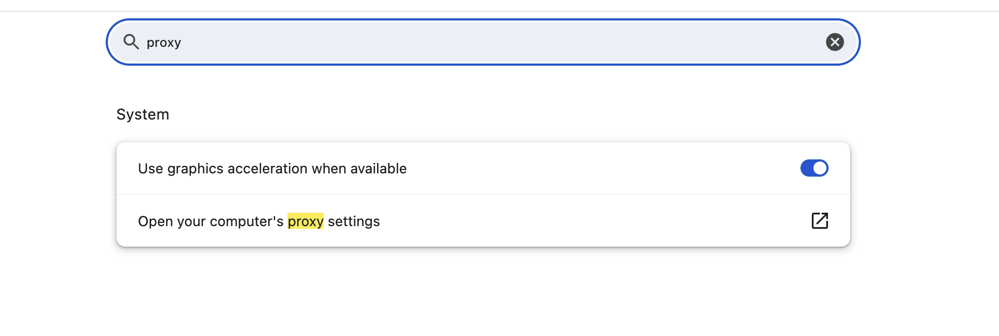

# Como burlar uma restricao de internet utilizando squid

Instale o squid no ubuntu
```
apt install squid
```

Voce precisara do seu IP publico para adicionar no arquivo de configuração

Accesse esse Website e pegue o seu IP

[https://meuip.com.br/](https://meuip.com.br/)

Dentro desse arquivo adione a sua configuracao
```
vim /etc/squid/conf.d/debian.conf 

acl myhost src SEU_IP_PUBLICO
http_access allow myhost
```


Reinicie o serviço
```
systemctl restart squid.service
```

Adicione o IP da sua VM nas configurações de proxy do seu navegador.


